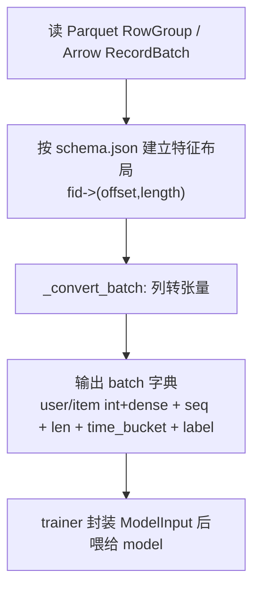
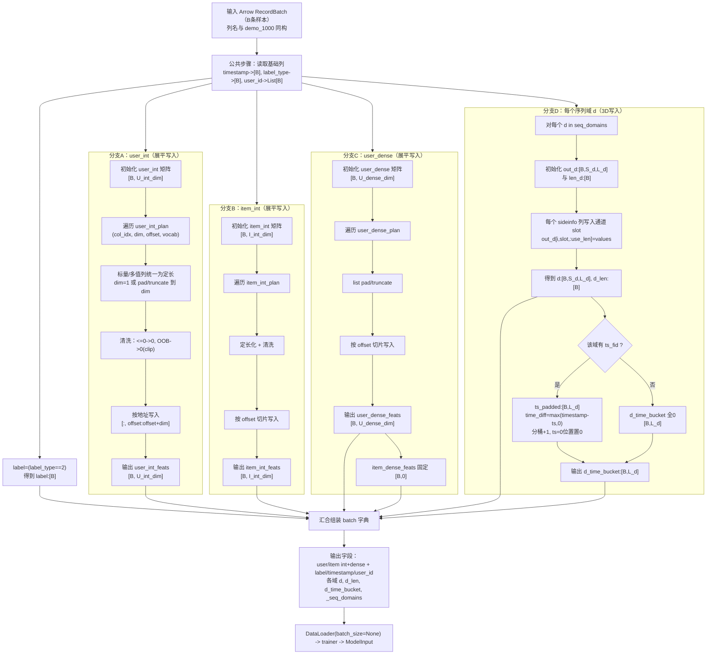

# demo_1000 -> dataset.py（通俗重写版）

这份文档专门讲清楚三件事：

1. 每个变量名是什么意思
2. 每一步到底做了什么
3. 数据是怎么从原始列一步步变成训练张量的

---

## 1. 先记住几个最重要的词

- `B`：batch size（一次处理多少条样本）
- `fid`：特征编号（例如 `user_int_feats_15` 的 `15`）
- `offset`：某个特征在“展平向量”里从第几位开始
- `length`：这个特征占几位（标量通常是1，多值特征可能>1）
- `L_d`：某个序列域 `d` 的最大长度（比如 `seq_a` 最多保留 256）
- `S_d`：某个序列域 `d` 的 sideinfo 特征数量（第2维通道数）
- `slot_of_xxx`：某个序列列在该域张量里的通道下标（“排第几个通道”）
- `OOB`：离散 id 超出词表范围（out of bound）

---

## 2. 原始数据长什么样（demo_1000 同构）

训练数据与 `demo_1000.parquet` 列结构一致（只差数据量），主要列族：

1. ID/Label（5列）

- `user_id`, `item_id`, `label_type`, `label_time`, `timestamp`

2. 用户离散特征（46列）

- `user_int_feats_{...}`，有标量列，也有 `list<int64>` 列

3. 用户稠密特征（10列）

- `user_dense_feats_{...}`，`list<float>`

4. 物品离散特征（14列）

- `item_int_feats_{...}`，有标量列，也有 `list<int64>`

5. 四个序列域（45列）

- `domain_a_seq_{...}`
- `domain_b_seq_{...}`
- `domain_c_seq_{...}`
- `domain_d_seq_{...}`

---

## 3. `dataset.py` 的主流程（先看全貌）

### 3.1 总览图（快速理解）

### 3.2 详细图（字段级 + shape 级）

> 小提示（读图时）：  
> - `offset/length` 代表“写入展平向量的地址区间”。  
> - `S_d` 是通道数（多少个序列特征），`L_d` 是时间长度上限。  
> - 序列部分不是展平，而是 3D 张量 `[B, S_d, L_d]`。

---

## 4. 每一步详细解释（统一风格）

## 步骤 1：`_load_schema`（先建立规则）

### 这一步干什么？

把 `schema.json` 解析成“可执行的布局规则”。

### 产出什么？

- `user_int_schema.entries = [(fid, offset, length), ...]`
- `item_int_schema.entries = [(fid, offset, length), ...]`
- `user_dense_schema.entries = [(fid, offset, length), ...]`
- `seq_domains`（如 `seq_a/b/c/d`）
- 每个域的：
  - `sideinfo_fids`
  - `ts_fid`
  - `max_len`（也就是 `L_d`）

### 通俗理解

这一步不是在处理样本值，而是在做“地图”：
告诉程序“每个列应该放到目标张量哪里”。

---

## 步骤 2：`__iter__`（读取批次）

### 这一步干什么？

- 按 RowGroup 从 parquet 流式读取
- 得到 Arrow `RecordBatch`
- 每个 `RecordBatch` 调 `_convert_batch`

### 结果

逐批产出训练可用的 batch 字典。

---

## 步骤 3：`_convert_batch`（核心转换）

下面按字段类别讲。

### 3.1 标签与基础字段

- `label_type` -> `label`
  - 规则：`label_type == 2` 记为 1，否则 0
  - shape：`[B]`
- `timestamp` -> shape `[B]`
- `user_id` -> Python 列表（长度 `B`）

---

### 3.2 user/item 离散特征（`*_int_feats`）

#### 规则

1. 标量列（`dim=1`）直接读
2. list 列（`dim>1`）pad/truncate 到固定 `dim`
3. 所有值做清洗：
   - `<=0` -> `0`
   - 超 vocab 的 id（OOB）-> `0`（当 `clip_vocab=True`）

#### 输出

- `user_int_feats`: `[B, U_int_dim]`
- `item_int_feats`: `[B, I_int_dim]`

#### 通俗理解

把“有的列是单个数、有的列是一串数”的混乱输入，
统一变成“固定长度的离散向量”。

---

### 3.3 user 稠密特征（`user_dense_feats`）

#### 规则

- 每个 `list<float>` 列按该 fid 的 dim 做 pad/truncate
- 写入展平向量对应区间

#### 输出

- `user_dense_feats`: `[B, U_dense_dim]`
- `item_dense_feats`: `[B, 0]`（当前实现如此）

---

### 3.4 序列域（最容易绕）

对每个域 `d`（如 `seq_a`）：

1. 建一个目标张量：`seq_d`，shape `[B, S_d, L_d]`
   - `S_d` = 该域 sideinfo 特征个数（第2维通道）
   - `L_d` = 该域最大长度（由配置给出）
2. 每个 sideinfo 列都写入自己的通道
3. 每条样本记录该域长度 `seq_d_len[i]`

输出：

- `seq_d`: `[B, S_d, L_d]`
- `seq_d_len`: `[B]`

---

### 3.5 时间桶 `seq_d_time_bucket`

若该域有时间戳列（`ts_fid`）：

1. 先拿到该域每个时间步的行为时间 `ts_padded`
2. 算 `time_diff = max(timestamp - ts_padded, 0)`
3. 用 `BUCKET_BOUNDARIES` 分桶，得到 bucket id
4. padding 位置强制 bucket=0

输出：

- `seq_d_time_bucket`: `[B, L_d]`

通俗理解：  
告诉模型“这个行为距离当前样本时间有多久”，并离散化成桶。

---

## 5. 重点名词再解释（你提到的那类）

### `L_a = 8` 是什么？从哪来？

- 含义：`seq_a` 域最多保留 8 个时间步
- 来源：`seq_max_lens` 配置（如果配了 `seq_a:8`）
- 没配置时，代码默认该域 `L_a=256`

### `slot_of_38` 是什么？

- 含义：`domain_a_seq_38` 在 `seq_a` 第二维（通道维）里的位置编号
- 通俗说：`seq_a` 有很多通道，`slot_of_38` 就是“38号列是第几个通道”

### `seq_a_len[i] = 3` 是什么？

- 含义：第 `i` 条样本在 `seq_a` 域里有效长度是 3
- 后面位置都是 padding（0）

---

## 6. 完整样例（按真实列名族）

下面举第 `i` 条样本：

### 原始输入（部分列展示）

- `label_type = 2`
- `timestamp = 1714020000`
- `user_int_feats_15 = [103, 0, -1, 9999999]`
- `item_int_feats_11 = [44, 45, 0, -1]`
- `user_dense_feats_61 = [0.23, 0.51, 0.12]`
- `domain_a_seq_38 = [45, 12, 7]`
- `domain_a_seq_46 = [1714019000, 1714019900, 0]`（假设是该域 ts 列）

### `_convert_batch` 后（补上“拼接/写入”的关键过程）

1. 标签

- `label[i] = 1`（因为 `label_type=2`）

2. user_int 清洗 + 拼接（按 `offset/length` 写入）

- 清洗：`[103, 0, -1, 9999999] -> [103, 0, 0, 0]`
  - `-1` 变 0
  - `9999999` 若 OOB 变 0
- 拼接方式（核心）：
  - schema 给这个 fid 一段切片 `(offset=o15, length=4)`
  - 写入：`user_int_feats[i, o15:o15+4] = [103,0,0,0]`
- 其他 `user_int_feats_{fid}` 也同样写入自己的切片  
  => 最终得到完整 `user_int_feats[i]`（长度 `U_int_dim`）

3. item_int 清洗 + 拼接（按 `offset/length` 写入）

- 清洗：`[44, 45, 0, -1] -> [44, 45, 0, 0]`
- 若 `item_int_feats_11` 的切片是 `(offset=o11, length=4)`：
  - `item_int_feats[i, o11:o11+4] = [44,45,0,0]`
- 同理把所有 item 离散列写完  
  => 得到完整 `item_int_feats[i]`（长度 `I_int_dim`）

4. user_dense 拼接（同样按切片写入）

- 例：`user_dense_feats_61=[0.23,0.51,0.12]`
- 若切片 `(offset=od61, length=3)`：
  - `user_dense_feats[i, od61:od61+3] = [0.23,0.51,0.12]`
- 其他 dense 列重复此过程  
  => 得到完整 `user_dense_feats[i]`（长度 `U_dense_dim`）

5. seq_a 写入（`[B,S_a,L_a]` 的“按通道拼接”）

- `L_a` 含义：`seq_a` 最大长度（来自 `seq_max_lens` 配置或默认 256）
- `slot_of_38` 含义：`domain_a_seq_38` 在 `seq_a` 第二维通道里的下标
- 写入：
  - `seq_a[i, slot_of_38, :3] = [45,12,7]`
  - `seq_a[i, slot_of_38, 3:L_a] = 0`
- 其他 `domain_a_seq_*` 列写入各自 `slot`  
  => 多列一起“按通道拼接”成完整 `seq_a[i,:,:]`
- `seq_a_len[i] = 3`（该样本在 `seq_a` 的有效长度）

6. seq_a 时间桶

- `time_diff = [1000, 100, 1714020000]`
- 分桶后前两位是有效桶 id
- 第三位因原 ts 为 0，最终强制 bucket=0
- padding 区域 bucket 也都是 0

---

## 7. 最终 batch 字段（一眼对照）

- `user_int_feats` `[B, U_int_dim]`
- `item_int_feats` `[B, I_int_dim]`
- `user_dense_feats` `[B, U_dense_dim]`
- `item_dense_feats` `[B, 0]`
- `label` `[B]`
- `timestamp` `[B]`
- `user_id` `List[B]`
- `_seq_domains` `List[str]`
- 每个域 `d`：
  - `d` `[B, S_d, L_d]`
  - `d_len` `[B]`
  - `d_time_bucket` `[B, L_d]`

---

## 8. 详细总结

这份 `dataset.py` 数据流程可以浓缩为 5 个关键点：

1. **先建规则，再处理数据**  
   - `_load_schema` 先把每个特征的 `(fid, offset, length)` 和每个序列域的 `(S_d, L_d)` 定好。  
   - 后续 `_convert_batch` 完全按这套规则落位，不是临时拼接。

2. **离散/稠密特征是“按地址写入”的展平拼接**  
   - `user_int`、`item_int`、`user_dense` 都是先建大矩阵，再把每个列写到 `offset:offset+length`。  
   - 这保证了模型输入顺序稳定且可复现。

3. **序列特征是“按通道写入”的 3D 拼接**  
   - 每个域输出 `d:[B,S_d,L_d]`，`S_d` 是通道数，`L_d` 是最大长度。  
   - 每个 `domain_x_seq_{fid}` 对应一个固定 `slot`，写入后自然形成多通道序列张量。

4. **长度与时间信息被显式保留**  
   - `d_len:[B]` 记录每条样本有效长度。  
   - `d_time_bucket:[B,L_d]` 记录时间差分桶；padding 或 `ts=0` 位置统一为 0。

5. **最终产物是标准化 batch 字典**  
   - 输出统一为固定 shape，直接被 trainer 封装为 `ModelInput`。  
   - 这一步完成了“原始列式数据 -> 可批训练张量”的关键桥接。

## 9. 一句话总结

`dataset.py` 的本质是：把 demo_1000 同构的“变长、异构、多域”原始列数据，稳定地转换成“固定 shape + 明确语义（len/time_bucket）”的训练 batch 字典。

