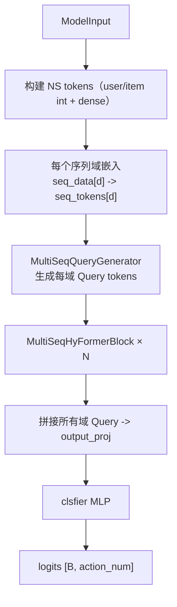
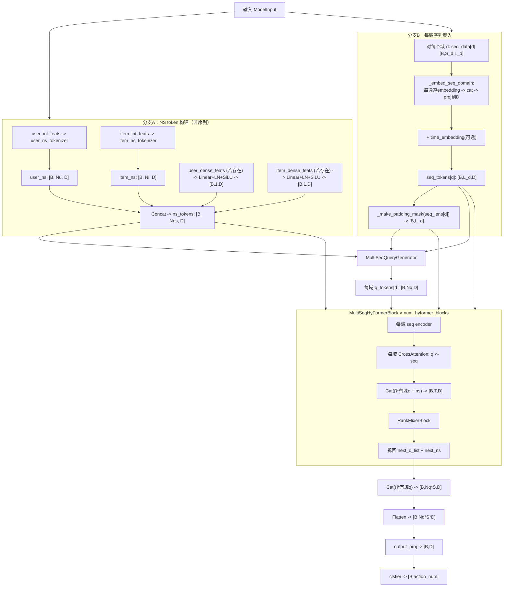

# `model.py` 全流程文档（仿 `dataset_pipeline_from_demo1000.md` 风格）

目标：用通俗、可对照代码的方式讲清楚 `model.py` 如何把 `ModelInput` 变成最终 `logits`。

---

## 1. 关键变量先看懂

- `B`：batch size
- `D`：`d_model`（模型主维度）
- `Nq`：`num_queries`（每个序列域生成多少个 Query token）
- `S`：`num_sequences`（序列域个数，通常 4）
- `Nns`：`num_ns`（非序列 token 总数）
- `T`：`Nq * S + Nns`（RankMixer 处理的 token 总数）
- `L_d`：域 `d` 的序列长度上限
- `S_d`：域 `d` 的 sideinfo 通道数（`seq_data[d]` 第二维）
- `emb_dim`：单 embedding 表输出维度（拼接前）

---

## 2. 输入输出协议（先抓主线）

## 输入：`ModelInput`

- `user_int_feats`：`[B, U_int_dim]`
- `item_int_feats`：`[B, I_int_dim]`
- `user_dense_feats`：`[B, U_dense_dim]`
- `item_dense_feats`：`[B, I_dense_dim]`（当前常见为 `[B,0]`）
- `seq_data[d]`：`[B, S_d, L_d]`
- `seq_lens[d]`：`[B]`
- `seq_time_buckets[d]`：`[B, L_d]`

## 输出

- `forward()`：`logits [B, action_num]`（默认 `action_num=1`）
- `predict()`：`(logits [B, action_num], output [B, D])`

---

## 3. 总流程图（快速理解）

---

## 4. 详细流程图（并行/汇合，贴合代码）

---

## 5. 每一步在做什么（按 `forward` 顺序）

## 步骤 1：构建 NS tokens（详细版：tokenizer 内部怎么跑）

这一阶段目标：把非序列特征（`user_int_feats`、`item_int_feats`、可选 dense）变成统一的 token 表示，供后续 Query/HyFormer 使用。

### 1.1 输入

- `user_int_feats`: `[B, U_int_dim]`
- `item_int_feats`: `[B, I_int_dim]`
- `user_dense_feats`: `[B, U_dense_dim]`（若存在）
- `item_dense_feats`: `[B, I_dense_dim]`（通常为空）

### 1.2 离散 tokenizer 的公共基础

无论 `group` 还是 `rankmixer`，都先做同样的“单 fid 编码”：

1. 遍历分组里的每个 `fid_idx`
2. 从 `feature_specs[fid_idx]` 取 `(vocab_size, offset, length)`
3. 从 `int_feats` 切片：
   - `length==1`：取 `int_feats[:, offset]`（标量）
   - `length>1`：取 `int_feats[:, offset:offset+length]`（多值）
4. embedding：
   - 标量：直接 lookup -> `[B, emb_dim]`
   - 多值：lookup 后按非零位做 masked mean -> `[B, emb_dim]`
5. 得到该 fid 的 `fid_emb [B, emb_dim]`

> 这里的“非零位”是因为 0 被当作 padding id。

### 1.3 `GroupNSTokenizer` 路径（每组一个 token）

对每个 group：

1. 收集本组所有 `fid_emb`，按最后一维拼接 -> `[B, len(group)*emb_dim]`
2. 经过该组投影层 `Linear + LN + SiLU` -> `[B, D]`
3. 这个 `[B, D]` 就是该组的 1 个 token

所有组堆叠后：

- `user_ns`: `[B, num_user_groups, D]`
- `item_ns`: `[B, num_item_groups, D]`

### 1.4 `RankMixerNSTokenizer` 路径（先全拼再切块）

`rankmixer` 与 `group` 的关键差异在这里：

1. 先按 **groups 顺序** 收集所有 `fid_emb`
2. 全部拼成一个大向量：`cat_emb [B, total_num_fids * emb_dim]`
3. 若不能整除 `num_ns_tokens`，先右侧补零
4. 把大向量均分成 `num_ns_tokens` 个 chunk
5. 每个 chunk 过独立投影层（`Linear + LN + SiLU`）得到 `[B, D]`
6. 堆叠后得到：
   - `user_ns`: `[B, user_ns_tokens, D]`
   - `item_ns`: `[B, item_ns_tokens, D]`

> 所以：`rankmixer` 的 token 数由 `user_ns_tokens/item_ns_tokens` 决定，  
> 但“特征组织顺序”仍由 groups 决定。

### 1.5 dense token 拼接（若有）

- `user_dense_feats` 过 `Linear + LN + SiLU` -> `[B, D]`，再 `unsqueeze(1)` -> `[B,1,D]`
- `item_dense_feats` 同理（若维度 > 0）

### 1.6 最终 NS token 合并

按代码顺序拼接（`user_ns -> user_dense_tok(可选) -> item_ns -> item_dense_tok(可选)`）：

- `ns_tokens`: `[B, Nns, D]`

其中：

- `Nns = user_ns_token数 + item_ns_token数 + dense_token数(可选)`

---

## 步骤 2：每域序列嵌入 `_embed_seq_domain`

对每个域 `d`：

1. 输入 `seq_data[d] [B,S_d,L_d]`
2. 每个通道 `s` 取 embedding：`[B,L_d,emb_dim]`
3. 通道级拼接：`[B,L_d,S_d*emb_dim]`
4. 线性投影到 `D`：`[B,L_d,D]`
5. 可选加时间桶 embedding：仍 `[B,L_d,D]`
6. 生成 mask：`[B,L_d]`（True=padding）

输出集合：

- `seq_tokens_list`（每域 `[B,L_d,D]`）
- `seq_masks_list`（每域 `[B,L_d]`）

---

## 步骤 3：生成每域 Query（`MultiSeqQueryGenerator`）

对每个域：

1. 该域序列做 masked mean pool -> `[B,D]`
2. 与 `ns_tokens` 展平后拼接成 `global_info [B,(Nns+1)*D]`
3. 经该域的 `Nq` 个独立 FFN，得到 `q_tokens[d] [B,Nq,D]`

---

## 步骤 4：HyFormer block 堆叠融合

每层 `MultiSeqHyFormerBlock`：

1. 每域序列编码（SwiGLU/Transformer/Longer）
2. 每域 Query 对该域序列做 CrossAttention
3. 拼接所有域 q + ns -> `[B,T,D]`
4. 过 `RankMixerBlock`
5. 再拆回“每域 q + ns”

其中：

- `T = Nq*S + Nns`
- 若 `rank_mixer_mode=full`，要求 `D % T == 0`

---

## 步骤 5：输出头

1. 拼接所有域 q：`[B,Nq*S,D]`
2. flatten：`[B,Nq*S*D]`
3. `output_proj`：`[B,D]`
4. `clsfier`：`[B,action_num]`

最终得到 `logits`。

---

## 6. 完整样例（按真实运行路径 + shape 代入）

假设：

- `B=256`
- `D=64`
- `S=4`（四个域）
- `Nq=2`
- `action_num=1`
- `Nns=8`（示例）
- 各域长度：`L_a=256, L_b=256, L_c=512, L_d=512`

### 6.1 输入（来自 dataset/trainer）

- `user_int_feats [256, U_int_dim]`
- `item_int_feats [256, I_int_dim]`
- `user_dense_feats [256, U_dense_dim]`
- `seq_a [256,S_a,256]`, `seq_b [256,S_b,256]`, `seq_c [256,S_c,512]`, `seq_d [256,S_d,512]`
- 对应 `*_len [256]`、`*_time_bucket [256,L_*]`

### 6.2 NS token 路径

- user/item tokenizer 后 -> `user_ns [256,Nu,64]`, `item_ns [256,Ni,64]`
- dense token（若有）各 `[256,1,64]`
- 拼接后：`ns_tokens [256,8,64]`（这里 8 是示例 `Nns`）

### 6.3 序列嵌入路径

- 每域 `_embed_seq_domain` 后：
  - `seq_a_tokens [256,256,64]`
  - `seq_b_tokens [256,256,64]`
  - `seq_c_tokens [256,512,64]`
  - `seq_d_tokens [256,512,64]`
- 各域 mask：
  - `[256,256] / [256,256] / [256,512] / [256,512]`

### 6.4 Query 生成

- 每域输出 `q_tokens[d] [256,2,64]`
- 共四域

### 6.5 进入每层 HyFormer block

- 拼接 q+ns 前：
  - q 共 `Nq*S = 8` 个 token
  - ns 共 `Nns = 8` 个 token
- 所以 `T = 8 + 8 = 16`
- 融合张量：`[256,16,64]`
- `full` 模式检查：`64 % 16 == 0`，合法

### 6.6 输出头

- 所有域 q 拼接：`[256,8,64]`
- flatten：`[256,512]`
- `output_proj`：`[256,64]`
- `clsfier`：`[256,1]`

即 `logits [256,1]`。

---

## 7. 与其他文件的接口关系

1. **上游 `dataset.py`**
- 提供 `seq_data/seq_lens/seq_time_buckets` 等标准字段
- shape 契约不满足会直接影响 `model.py` 前向

2. **中游 `trainer.py`**
- 把 batch 字典封装成 `ModelInput`
- 调用 `model.forward()` / `model.predict()`

3. **入口 `train.py`**
- 传入 `model_args`
- 决定 tokenizer 类型、query 数、时间桶开关等

---

## 8. 易错点（实战高频）

1. `rank_mixer_mode=full` 时忘记检查 `D % T == 0`。  
2. `num_time_buckets` 与 dataset 常量不一致会埋下索引风险。  
3. `emb_skip_threshold` 太小会让大量特征变零向量，效果下降。  
4. `seq_id_threshold` 与 `emb_skip_threshold` 含义不同，别混用。  
5. `LongerEncoder` 会改序列长度（压到 `top_k`），后续必须用更新后的 mask。  

---

## 9. 详细总结

`model.py` 的核心不是单一注意力层，而是一条“多源信息融合链”：

1. 把非序列特征编码为 NS tokens（可解释的静态上下文）  
2. 把每个序列域独立编码成动态序列 token（保留时间信息）  
3. 用 Query 机制让每个域“从自己的序列里读重点”  
4. 再用 HyFormer block 在域间进行 token 级融合  
5. 最终压缩到统一表示并输出任务 logits  

## 10. 一句话总结

`model.py` 把“离散 + 稠密 + 多域序列”三类输入统一成一条可训练的 token 融合路径，最终输出用于二分类（或多标签）的 logits。

