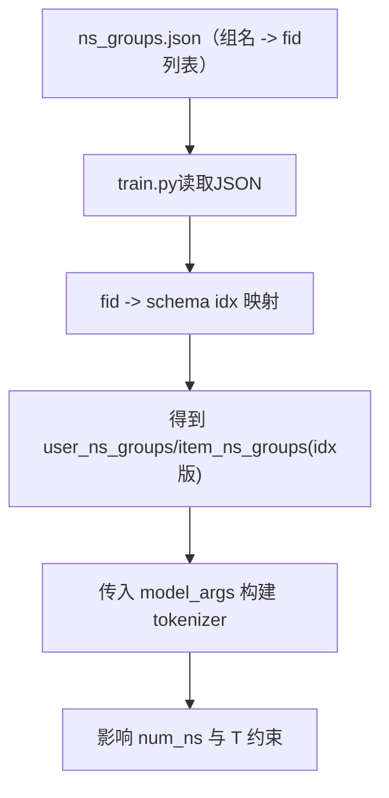
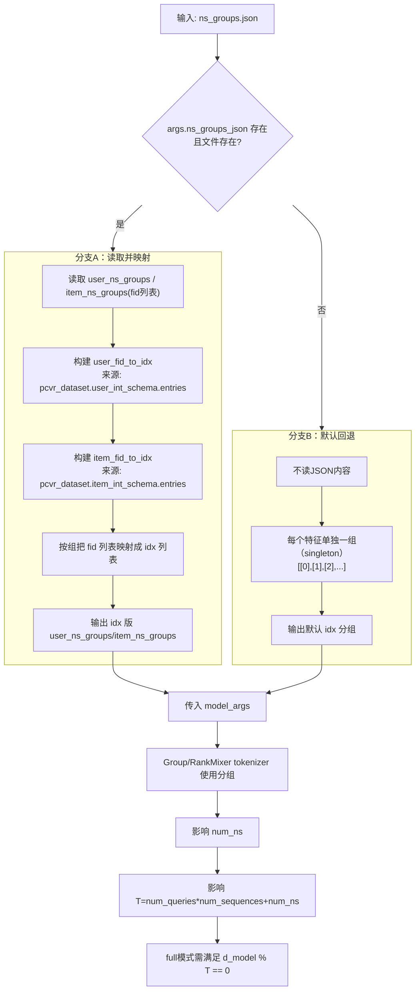

# `ns_groups.json` 全流程文档（仿 `dataset_pipeline_from_demo1000.md` 风格）

目标：用通俗、可对照代码的方式讲清楚 `ns_groups.json` 在训练链路中的作用：它如何被 `train.py` 读取、映射、并最终影响 `model.py` 的 NS token 结构。

---

## 1. 关键变量先看懂

- `fid`：特征编号（如 `user_int_feats_15` 的 `15`）
- `group`：一组 fid，表示这些特征要被同一组语义处理
- `user_ns_groups`：用户侧分组字典（组名 -> fid 列表）
- `item_ns_groups`：物品侧分组字典（组名 -> fid 列表）
- `fid_to_idx`：`train.py` 运行时构造的映射（fid -> schema 中的位置索引）
- `num_ns`：模型里非序列 token 数量
- `T`：`num_queries * num_sequences + num_ns`（`rank_mixer_mode=full` 约束关键量）

---

## 2. 这个文件在项目中的位置

`ns_groups.json` 本质上是“分组配置文件”，不做计算，但会影响模型结构：

1. 被 `train.py` 读取  
2. 从 fid 分组映射到 idx 分组  
3. 传入 `PCVRHyFormer` 的 tokenizer 构造  
4. 影响 `num_ns`，进而影响 `T` 及结构可行性

---

## 3. 总流程图（快速理解）

---

## 4. 详细流程图（按代码真实逻辑）

---

## 5. 文件内容怎么读（当前这个 `ns_groups.json`）

## 5.1 说明字段（以下划线开头）

这些键只用于说明，不参与训练逻辑：

- `_purpose`
- `_format`
- `_usage`
- `_comment`
- `_note_T`
- `_note_user_dense`
- `_note_shared_fids`

## 5.2 真正参与逻辑的字段

只有两个：

1. `user_ns_groups`
2. `item_ns_groups`

示例（用户侧）：

- `U1: [1, 15]`
- `U2: [48, 49, 89, 90, 91]`
- ...

示例（物品侧）：

- `I1: [11, 13]`
- `I2: [5, 6, 7, 8, 12]`
- ...

---

## 6. 完整样例（按真实代码执行顺序）

假设：

- `train.py` 读取到本文件
- `pcvr_dataset.user_int_schema.entries` 中存在 fid 顺序（示意）：
  - `[..., (1, ...), (15, ...), (48, ...), ...]`

### 6.1 JSON 侧原始分组（fid 版）

- `U1 = [1, 15]`
- `I2 = [5, 6, 7, 8, 12]`

### 6.2 `train.py` 映射后（idx 版）

假设映射关系（示意）：

- `user_fid_to_idx[1] = 0`
- `user_fid_to_idx[15] = 1`
- `item_fid_to_idx[5] = 0`
- `item_fid_to_idx[6] = 1`
- `item_fid_to_idx[7] = 2`
- ...

则：

- `U1: [1,15] -> [0,1]`
- `I2: [5,6,7,8,12] -> [0,1,2,3,4]`

最终模型拿到的是 `idx` 分组，而不是原始 fid 分组。

### 6.3 对模型 token 数的影响（关键）

在 `group` tokenizer 下：

- 用户组数 = `len(user_ns_groups)`（当前是 7）
- 物品组数 = `len(item_ns_groups)`（当前是 4）
- 再加上可能存在的 user_dense token（通常 +1）

所以通常：

- `num_ns ≈ 7 + 4 + 1 = 12`（示例）

若 `num_queries=1`, `num_sequences=4`：

- `T = 1*4 + 12 = 16`

若 `rank_mixer_mode=full` 且 `d_model=64`：

- `64 % 16 == 0`，结构合法

---

## 7. 与 tokenizer 类型的关系（非常重要）

## 7.1 `ns_tokenizer_type=group`

- 每个分组直接对应一个 token
- 组数变化会直接改变 `num_ns`

## 7.2 `ns_tokenizer_type=rankmixer`

- 分组仍有意义（决定 fid 的语义组织顺序）
- 但 token 数可由 `user_ns_tokens/item_ns_tokens` 单独指定
- 因此 `num_ns` 不一定等于“组数之和”

---

## 8. 易错点（实战高频）

1. JSON 里出现 schema 中不存在的 fid，会在映射时报错。  
2. 忘记区分“说明键（`_` 开头）”和“真正配置键”。  
3. 改分组后没重新检查 `T` 与 `d_model` 的整除关系。  
4. 误以为 rankmixer 完全不看分组（实际上仍用分组组织语义）。  
5. 把 `ns_groups_json=""` 理解为“空分组文件”，实际会触发默认 singleton 分组分支。  

---

## 9. 详细总结

`ns_groups.json` 是一个“结构控制开关”：

1. 用业务 fid 分组表达非序列特征的语义组织  
2. 在 `train.py` 中映射成模型可用的 idx 分组  
3. 决定 tokenizer 如何聚合离散特征  
4. 通过 `num_ns` 间接影响 `T` 与结构合法性  
5. 与 `run.sh`/`train.py` 参数联动，直接影响实验可行空间  

## 10. 一句话总结

`ns_groups.json` 决定了“非序列特征怎么抱团编码成 token”，是模型结构与可行超参数约束的重要上游配置。

