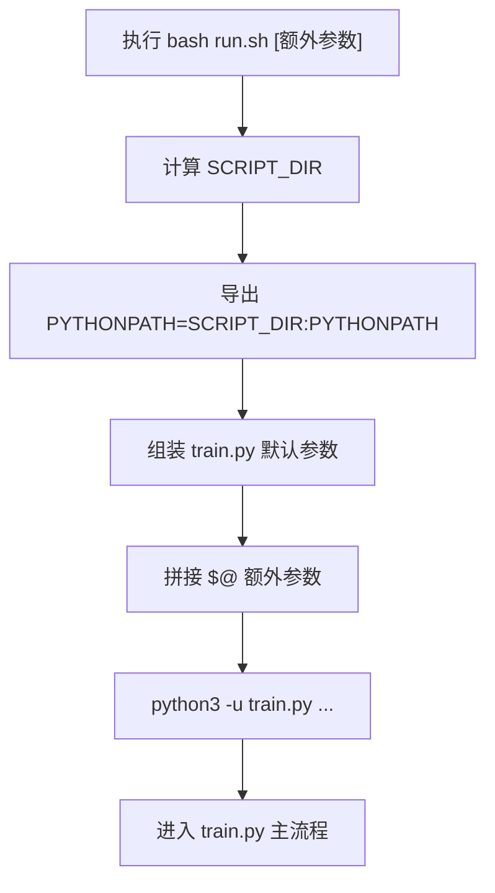
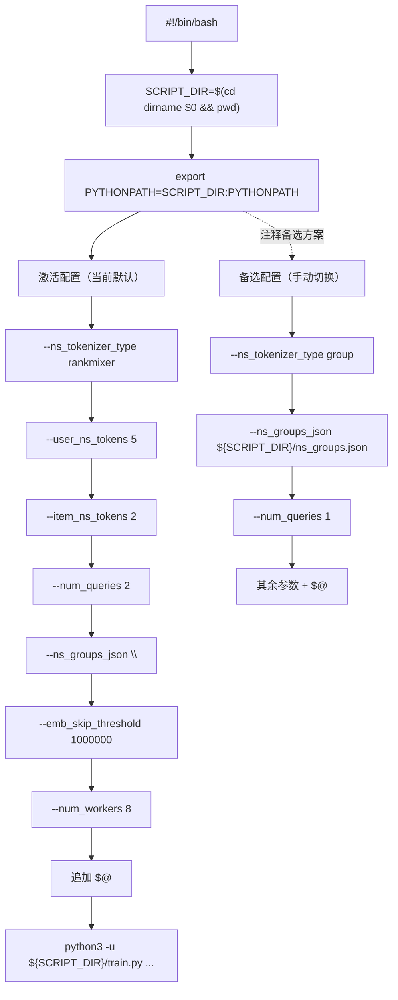

# `run.sh` 全流程文档（仿 `dataset_pipeline_from_demo1000.md` 风格）

目标：用通俗、可对照代码的方式讲清楚 `run.sh` 如何组织训练启动参数，以及它和 `train.py`/`model.py` 的关键联动关系。

---

## 1. 关键变量先看懂

- `SCRIPT_DIR`：`run.sh` 所在目录的绝对路径
- `PYTHONPATH`：Python 模块搜索路径；脚本把项目目录追加进去
- `"$@"`：你在执行 `bash run.sh ...` 时额外传入的所有参数
- `ns_tokenizer_type`：NS tokenizer 类型（`rankmixer` 或 `group`）
- `user_ns_tokens / item_ns_tokens`：rankmixer 模式下 user/item 的 NS token 数
- `num_queries`：每个序列域生成多少 Query token
- `emb_skip_threshold`：超过阈值的高基数特征不建 embedding
- `T`：`num_queries * num_sequences + num_ns`（`rank_mixer_mode=full` 时影响可行性）

---

## 2. 这个文件在全项目的位置

`run.sh` 是“训练命令模板”，主要做三件事：

1. 统一运行目录和导入路径
2. 固定一套默认实验参数
3. 提供一套可切换的备选参数（注释块）

它不做训练计算，只负责“如何调用 `train.py`”。

---

## 3. 总流程图（快速理解）



---

## 4. 详细流程图（按代码真实逻辑）



> 注意：备选方案当前是注释状态，不会执行。  
> 只有你手动注释/反注释后才会切换。

---

## 5. 每一步在做什么（按脚本顺序）

## 步骤 1：确定脚本目录

```bash
SCRIPT_DIR="$(cd "$(dirname "$0")" && pwd)"
```

作用：

- 无论你从哪个目录执行，都能准确定位到项目根路径

---

## 步骤 2：设置导入路径

```bash
export PYTHONPATH="${SCRIPT_DIR}:${PYTHONPATH}"
```

作用：

- 保证 `train.py` 能稳定导入同目录下的 `dataset/model/trainer/utils`

---

## 步骤 3：执行默认训练命令（当前激活）

默认传入参数：

- `--ns_tokenizer_type rankmixer`
- `--user_ns_tokens 5`
- `--item_ns_tokens 2`
- `--num_queries 2`
- `--ns_groups_json ""`
- `--emb_skip_threshold 1000000`
- `--num_workers 8`
- `"$@"`（追加用户传入参数）

---

## 步骤 4：`"$@"` 的作用（非常关键）

`"$@"` 会把你在命令行输入的额外参数附加到最后，例如：

```bash
bash run.sh --batch_size 512 --lr 5e-5
```

这样最终命令末尾会出现：

- `--batch_size 512`
- `--lr 5e-5`

通常能覆盖前面同名默认参数（按 argparse 常见行为，以最后一个为准）。

---

## 6. 完整样例（按真实运行路径 + 参数联动）

假设你执行：

```bash
bash run.sh --batch_size 256 --d_model 64 --rank_mixer_mode full
```

### 6.1 最终关键参数会是

- tokenizer：`rankmixer`
- `user_ns_tokens=5`
- `item_ns_tokens=2`
- `num_queries=2`
- `d_model=64`
- `rank_mixer_mode=full`

### 6.2 这会如何影响模型结构（和 `train.py/model.py` 联动）

1. `train.py` 会把这些参数传入 `model_args`
2. 模型里 token 总数：
   - `T = num_queries * num_sequences + num_ns`
3. `rank_mixer_mode=full` 时需要：
   - `d_model % T == 0`

也就是说，`run.sh` 里的少量参数会直接改变 `T`，进而影响模型是否合法。

### 6.3 `--ns_groups_json ""` 的实际效果

在 `train.py` 中，这个值对应“路径为空且文件不存在”，会走默认分组分支：

- 每个特征单独一组（singleton）

并不是“加载一个空 JSON 文件”。

---

## 7. 备选方案的实际意义（注释块）

注释中的 group 方案是：

- `--ns_tokenizer_type group`
- `--ns_groups_json "${SCRIPT_DIR}/ns_groups.json"`
- `--num_queries 1`

注释里给出的约束示例是合理的：

- 当 `num_ns=12`、`num_sequences=4`、`num_queries=1` 时
- `T=16`
- 对 `d_model=64` 有 `64%16==0`

这说明备选方案本质上是“更强分组语义 + 更严格结构约束”的配置。

---

## 8. 易错点（实战高频）

1. 在 Windows PowerShell 直接跑 `run.sh` 可能失败（需 bash 环境）。  
2. 忘记 `"$@"` 会丢失外部覆盖参数能力。  
3. `--ns_groups_json ""` 不是读取空文件，而是触发默认分组分支。  
4. 调整 `num_queries` 时要同步检查 `d_model % T` 约束。  
5. `num_workers=8` 不是通用最优，需按机器和 IO 实测。  

---

## 9. 详细总结

`run.sh` 的价值是把“训练入口参数策略”固化成可复用模板：

1. 固化路径与导入环境，降低启动不一致风险  
2. 固化一套默认可跑配置（rankmixer）  
3. 保留一套可解释备选配置（group）  
4. 通过 `"$@"` 保持实验灵活性  
5. 直接影响 `train.py -> model.py` 的结构约束链路  

## 10. 一句话总结

`run.sh` 是项目训练的“参数路由器”：它决定 `train.py` 会以哪套结构超参和数据策略启动。

