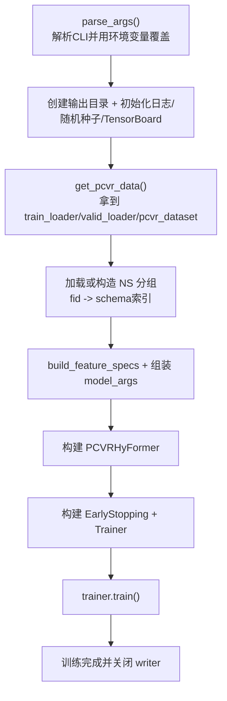
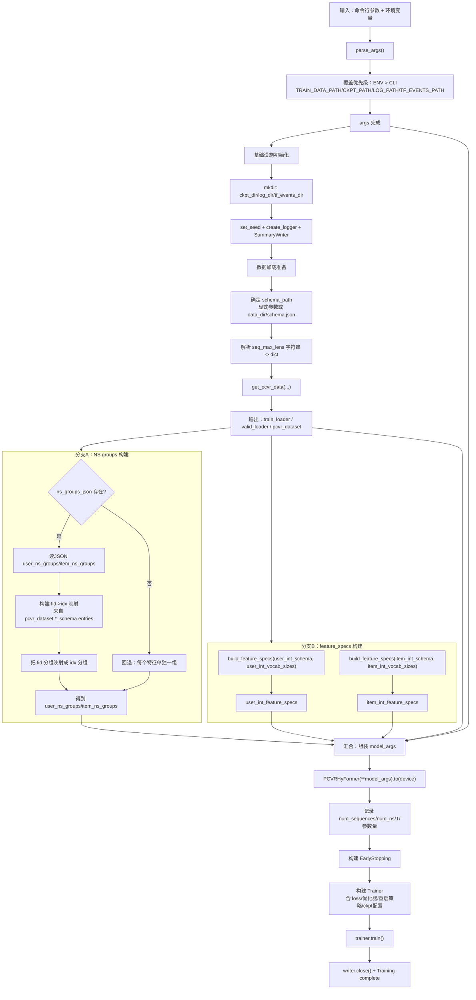

# `train.py` 训练入口文档（仿 `dataset_pipeline_from_demo1000.md` 风格）

目标：用通俗、可对照代码的方式讲清楚 `train.py` 如何把配置、数据、模型、训练器串起来。

---

## 1. 关键变量先看懂

- `args`：所有训练参数（CLI + 环境变量覆盖后）
- `data_dir`：训练数据目录（应包含 `*.parquet` 与 `schema.json`）
- `schema_path`：schema 文件路径（可显式传，也可默认 `data_dir/schema.json`）
- `seq_max_lens`：每个序列域的截断长度配置（如 `seq_a:256, seq_c:512`）
- `train_loader / valid_loader`：训练/验证迭代器
- `pcvr_dataset`：不仅是数据集对象，还包含 schema 元信息（维度、vocab、域信息）
- `user_ns_groups / item_ns_groups`：NS 分组（fid 映射成 schema 索引后）
- `feature_specs`：`(vocab_size, offset, length)`，给模型 tokenizer 用
- `model_args`：模型构造参数总表
- `T`：`num_queries * num_sequences + num_ns`（`rank_mixer_mode=full` 时很关键）

---

## 2. 总流程图（快速理解）



---

## 3. 详细流程图（并行/汇合更贴近代码）



---

## 4. 每一步在做什么（按代码顺序）

## 步骤 1：`parse_args()`（参数入口）

### 做什么
解析训练参数，并用环境变量覆盖关键路径参数。

### 关键点

- 覆盖规则：
  - `TRAIN_DATA_PATH` -> `args.data_dir`
  - `TRAIN_CKPT_PATH` -> `args.ckpt_dir`
  - `TRAIN_LOG_PATH` -> `args.log_dir`
  - `TRAIN_TF_EVENTS_PATH` -> `args.tf_events_dir`
- 这意味着环境变量优先级更高。

---

## 步骤 2：初始化运行环境

### 做什么

1. 创建输出目录
2. 固定随机种子
3. 初始化 logger
4. 创建 TensorBoard writer

### 数据形态
这一步还没有 batch 张量，属于“运行环境准备”。

---

## 步骤 3：准备数据加载

### 做什么

1. 确定 `schema_path`
2. 解析 `seq_max_lens` 字符串
3. 调 `get_pcvr_data(...)`

### 输出

- `train_loader`
- `valid_loader`
- `pcvr_dataset`（很重要，后面会从里面拿模型构造信息）

---

## 步骤 4：构建 NS 分组

### 分支 A：有 `ns_groups_json`

1. 读取 JSON 的 `user_ns_groups/item_ns_groups`（fid 列表）
2. 用 `pcvr_dataset.user_int_schema.entries` 建 `fid->idx`
3. 把每个 fid 分组映射成 idx 分组

### 分支 B：无 JSON

- 回退策略：每个特征单独成组（singleton）

---

## 步骤 5：构建 feature_specs

调用 `build_feature_specs(...)`：

- 输入：`entries(fid, offset, length)` + `per_position_vocab_sizes`
- 输出：`(vocab_size, offset, length)`

作用：给模型里的 NS tokenizer使用。

---

## 步骤 6：组装并构建模型

### model_args 主要来源

1. 来自 `args`：结构超参、优化相关开关
2. 来自 `pcvr_dataset`：
   - `user_dense_dim`
   - `item_dense_dim`
   - `seq_vocab_sizes`
3. 来自步骤 4/5：
   - `user_ns_groups/item_ns_groups`
   - `user/item_int_feature_specs`

### 时间桶参数

- `num_time_buckets = NUM_TIME_BUCKETS`（若 `use_time_buckets=True`）
- 否则为 0

### 额外日志

构建后会记录：

- `num_sequences`
- `num_ns`
- `T = num_queries * num_sequences + num_ns`
- 总参数量

---

## 步骤 7：构建训练器并启动训练

### 做什么

1. 构建 `EarlyStopping`
2. 构建 `ckpt_params`（layer/head/hidden）
3. 构建 `PCVRHyFormerRankingTrainer(...)`
4. 调 `trainer.train()`
5. 关闭 `writer`

### 结果

进入真正训练循环（loss、反向、验证、保存 best checkpoint）。

---

## 5. 完整样例（按真实运行路径 + shape 变化）

下面用一个“可直接运行”的例子，把 `train.py` 这层发生的状态变化讲完整。

### 5.1 启动命令（示例）

```bash
python train.py \
  --batch_size 256 \
  --num_queries 2 \
  --d_model 64 \
  --seq_max_lens "seq_a:256,seq_b:256,seq_c:512,seq_d:512" \
  --ns_tokenizer_type rankmixer \
  --user_ns_tokens 5 \
  --item_ns_tokens 2
```

并设置环境变量：

- `TRAIN_DATA_PATH=/path/to/data`
- `TRAIN_CKPT_PATH=/path/to/ckpt`
- `TRAIN_LOG_PATH=/path/to/log`
- `TRAIN_TF_EVENTS_PATH=/path/to/tfevents`

### 5.2 `parse_args` 后（配置状态）

1. 路径参数被环境变量覆盖（优先于 CLI）
2. `seq_max_lens` 从字符串解析成字典：
   - `{'seq_a':256, 'seq_b':256, 'seq_c':512, 'seq_d':512}`

此时还没有样本张量，只有 `args` 配置对象。

### 5.3 `get_pcvr_data` 后（数据迭代状态）

`train.py` 拿到：

- `train_loader`
- `valid_loader`
- `pcvr_dataset`

接下来每个 batch（来自 `dataset.py`）典型 shape 是：

- `user_int_feats`: `[B, U_int_dim]`
- `item_int_feats`: `[B, I_int_dim]`
- `user_dense_feats`: `[B, U_dense_dim]`
- `item_dense_feats`: `[B, 0]`
- 每域 `seq_d`: `[B, S_d, L_d]`
- 每域 `seq_d_len`: `[B]`
- 每域 `seq_d_time_bucket`: `[B, L_d]`
- `label`: `[B]`

代入本例 `B=256`：

- `seq_a`: `[256, S_a, 256]`
- `seq_b`: `[256, S_b, 256]`
- `seq_c`: `[256, S_c, 512]`
- `seq_d`: `[256, S_d, 512]`

### 5.4 NS 分组与 feature_specs（模型输入规格状态）

这一段在代码里其实做了两件独立但强关联的事：  
**(A) 构造 NS 分组** + **(B) 构造 feature_specs**。

#### A. NS 分组构造（`user_ns_groups` / `item_ns_groups`）

1. 分支判断  
   - 若 `args.ns_groups_json` 存在且文件可读：走“自定义分组”  
   - 否则：走“默认 singleton 分组”（每个特征单独一组）

2. 自定义分组时的关键映射  
   - 先从 `pcvr_dataset.*_schema.entries` 建立：
     - `user_fid_to_idx = {fid: idx}`
     - `item_fid_to_idx = {fid: idx}`
   - 再把 JSON 里的 fid 列表映射成 idx 列表：
     - `user_ns_groups = [[idx(fid1), idx(fid2), ...], ...]`
     - `item_ns_groups = [[idx(fid1), idx(fid2), ...], ...]`

3. 默认分组（无 JSON）  
   - `user_ns_groups = [[0], [1], [2], ...]`
   - `item_ns_groups = [[0], [1], [2], ...]`

通俗理解：  
JSON 里写的是“业务 fid 分组”，模型吃的是“特征位置索引分组”，这一步就是翻译器。

#### B. `build_feature_specs` 构造

分别对 user/item int 执行：

- 输入：
  - `schema.entries`: `(fid, offset, length)`
  - `per_position_vocab_sizes`
- 处理：
  - 在 `[offset:offset+length]` 区间取最大 vocab，得到该特征 vocab_size
- 输出：
  - `user_int_feature_specs = [(vocab_size, offset, length), ...]`
  - `item_int_feature_specs = [(vocab_size, offset, length), ...]`

每一项的含义：

- `vocab_size`：该特征 embedding 表规模依据
- `offset`：该特征在展平向量中的起点
- `length`：该特征占用长度（标量=1，多值特征>1）

#### C. 这两块结果如何被模型使用

最终进入 `model_args`：

- 分组部分：`user_ns_groups`, `item_ns_groups`
- 布局部分：`user_int_feature_specs`, `item_int_feature_specs`

它们共同决定：

1. NS tokenizer 怎么把离散特征“分组并编码”成 token；  
2. 每个 fid 从展平输入向量的哪里取值、用多大词表做 embedding。  

所以这一步本质是：  
把“数据 schema + 分组配置”转换成“模型可执行的结构化输入规范”。

### 5.5 构建模型后的关键维度（结构状态）

在本例中：

- `num_queries = 2`
- `num_sequences = len(pcvr_dataset.seq_domains)`（通常是 4）
- `num_ns = model.num_ns`（由 tokenizer 方案+分组决定）

因此：

- `T = num_queries * num_sequences + num_ns`

如果 `rank_mixer_mode=full`，要求：

- `d_model % T == 0`

这就是为什么 `num_queries`、NS 分组和 `d_model` 必须联动看。

### 5.6 进入 `trainer.train()` 后（首个 step 的 shape 链路）

虽然具体执行在 `trainer.py`，但从 `train.py` 视角，第一次 step 会走到：

1. batch 字典 -> `ModelInput`
2. `model(ModelInput)` -> `logits: [B, action_num]`
3. 默认 `action_num=1`，则 `logits: [256,1]`
4. trainer 内 `squeeze(-1)` 后与 `label:[256]` 计算 loss

也就是说，`train.py` 的“编排结果”最终落在：

- 输入：`dataset` 的标准 batch 字典  
- 输出：模型可训练的 `logits` 与损失闭环

### 5.7 本次运行会看到的外部产物

1. 日志：`log_dir/train.log`
2. TensorBoard：`tf_events_dir/*tfevents*`
3. checkpoint：`ckpt_dir/.../model.pt`（含 sidecar）

---

## 6. 最终产物（train.py 结束后你能拿到什么）

1. 日志文件
- `log_dir/train.log`

2. TensorBoard 事件
- `tf_events_dir/*tfevents*`

3. checkpoint 目录
- best/step checkpoint（含 `model.pt`，以及 trainer 写入的 sidecar）

---

## 7. 易错点（实战最常见）

1. `TRAIN_TF_EVENTS_PATH` 未设置时会影响 writer 路径。  
2. `schema_path` 不存在会直接抛 `FileNotFoundError`。  
3. `ns_groups_json` 里 fid 若不在 schema 中会映射失败。  
4. 修改 `num_queries` 后要关注 `T` 相关约束（尤其 full 模式）。  
5. 过大的 `num_workers` 不一定更快，需按机器调优。  

---

## 8. 详细总结

`train.py` 的核心价值不是“算张量”，而是“做编排”：

1. 统一参数入口（并处理环境变量优先级）  
2. 把数据侧（`get_pcvr_data`）与模型侧（`PCVRHyFormer`）对齐  
3. 把分组信息（NS groups）从业务 fid 映射到模型索引  
4. 把训练策略（loss/优化器/早停/重启）交给 trainer 执行  
5. 保证训练产物（日志、事件、checkpoint）可追踪、可复现

## 9. 一句话总结

`train.py` 就是整个项目的“训练总开关”：负责把配置、数据、模型和训练器拼成一条可执行且可复现的训练流水线。

