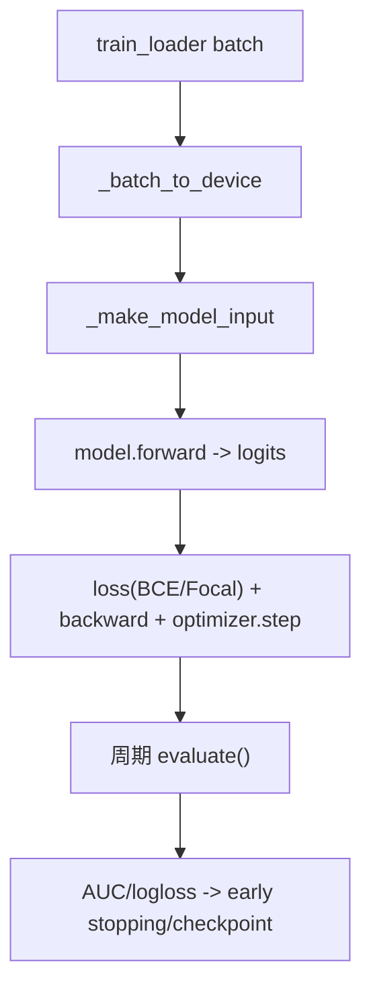
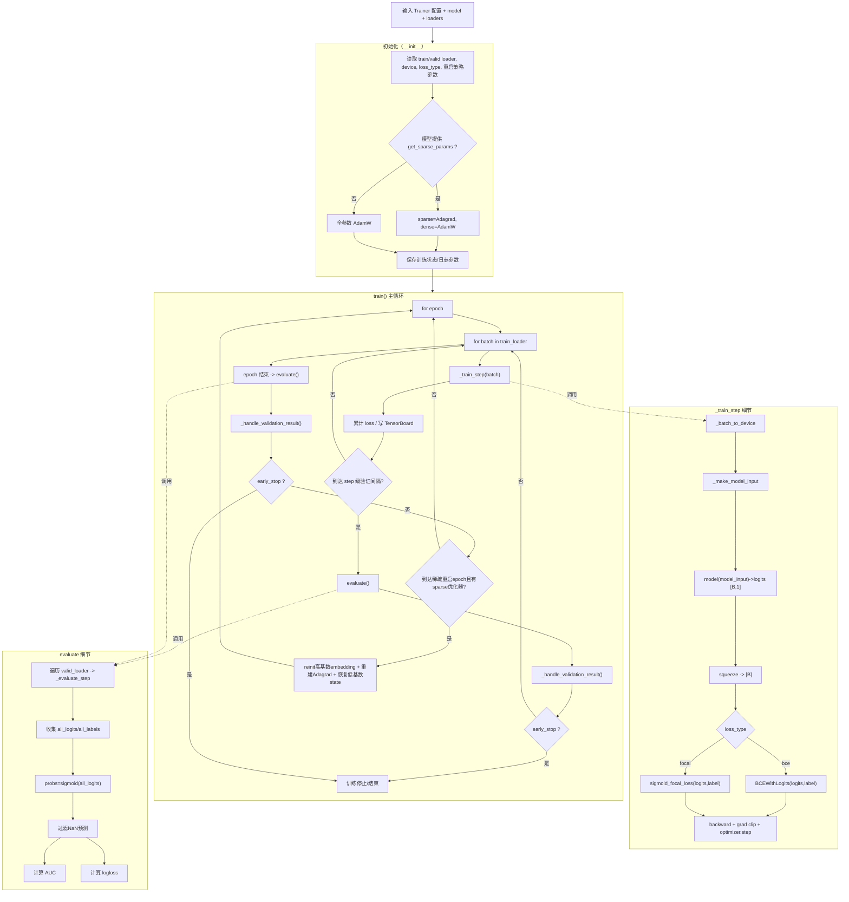

# `trainer.py` 全流程文档（仿 `dataset_pipeline_from_demo1000.md` 风格）

目标：用通俗、可对照代码的方式讲清楚 `trainer.py` 如何把 batch 训练起来并做评估、早停、保存。

---

## 1. 关键变量先看懂

- `B`：当前 batch 大小
- `device_batch`：把 batch 中所有 tensor 放到 `device` 后的字典
- `ModelInput`：喂给模型的标准输入结构
- `logits`：模型原始输出（未过 sigmoid）
- `loss_type`：`bce` 或 `focal`
- `dense_optimizer`：`AdamW`（非 embedding 参数）
- `sparse_optimizer`：`Adagrad`（embedding 参数，若模型提供）
- `total_step`：全局 step 计数
- `val_auc / val_logloss`：验证指标
- `early_stopping`：早停与最佳模型状态管理器

---

## 2. 输入输出协议

## 输入（来自 DataLoader）

典型 batch 字段：

- `user_int_feats [B, U_int_dim]`
- `item_int_feats [B, I_int_dim]`
- `user_dense_feats [B, U_dense_dim]`
- `item_dense_feats [B, 0]`（当前常见）
- `label [B]`
- `_seq_domains`
- 每域 `d`：
  - `d [B, S_d, L_d]`
  - `d_len [B]`
  - `d_time_bucket [B, L_d]`（可能缺失，trainer 会补 0）

## 输出（训练侧产物）

- 更新后的模型参数
- 训练/验证标量日志
- checkpoint（含 sidecar）
- 早停状态

---

## 3. 总流程图（快速理解）

---

## 4. 详细流程图（并行/分支/汇合）

---

## 5. 每一步在做什么（按代码顺序）

## 步骤 1：初始化 `__init__`

1. 保存 model / loader / 配置
2. 若模型支持稀疏参数分组：
   - Embedding 参数 -> Adagrad
   - 非 Embedding 参数 -> AdamW
3. 否则全参数 AdamW
4. 保存 checkpoint 相关元信息（schema/ns_groups/train_config）

---

## 步骤 2：`_batch_to_device`

- 输入：CPU batch 字典
- 操作：所有 tensor `.to(device, non_blocking=True)`；非 tensor 原样保留
- 输出：`device_batch`

shape 不变，只是设备变化。

---

## 步骤 3：`_make_model_input`

1. 从 `device_batch` 读取固定字段（user/item int+dense）
2. 遍历 `_seq_domains` 组装：
   - `seq_data[d]`
   - `seq_lens[d]`
   - `seq_time_buckets[d]`（若缺失则补 `torch.zeros(B,L)`）
3. 返回 `ModelInput`

---

## 步骤 4：`_train_step`

1. `device_batch = _batch_to_device(batch)`
2. `label = device_batch['label'].float()` -> `[B]`
3. `zero_grad()`
4. `model_input = _make_model_input(device_batch)`
5. `logits = model(model_input)` -> `[B,1]`
6. `logits.squeeze(-1)` -> `[B]`
7. 按 `loss_type` 计算 loss（BCE 或 Focal）
8. `loss.backward()`
9. `clip_grad_norm_(..., max_norm=1.0)`
10. `dense_optimizer.step()`；若有 `sparse_optimizer` 也 step

返回 `loss.item()`。

---

## 步骤 5：`evaluate`

1. `model.eval()`
2. 遍历 `valid_loader` 调 `_evaluate_step`
3. 拼接得到：
   - `all_logits [N_valid]`
   - `all_labels [N_valid]`
4. `probs = sigmoid(all_logits)`
5. 过滤 NaN 预测
6. 计算：
   - `AUC`（标签单一时回退 0）
   - `logloss`

---

## 步骤 6：`_handle_validation_result`

作用：以“原子化逻辑”保存 best checkpoint，避免出现只有 sidecar 没 model 的空目录。

流程：

1. 先判断这次分数是否“可能新 best”
2. 若不是：不做落盘，仅更新 early stopping 计数
3. 若是：
   - 设定本 step 的 best 路径
   - 清理旧 best 目录
   - 调 `EarlyStopping` 真正确认并保存 `model.pt`
   - 仅在确认成功后写 sidecar

---

## 步骤 7：epoch 末尾稀疏重启（可选）

触发条件：

- `epoch >= reinit_sparse_after_epoch`
- 且存在 `sparse_optimizer`

执行：

1. 先保存旧 Adagrad state（按 `data_ptr`）
2. 调模型重置高基数 embedding
3. 重建 Adagrad
4. 恢复低基数 embedding 的旧 state

目的：抑制高基数 embedding 过拟合累积。

---

## 6. 完整样例（按真实运行路径 + shape 代入）

假设：

- `batch_size=256`
- `action_num=1`
- `loss_type='bce'`
- 某个 batch 含 4 个序列域

### 6.1 单个 train step 的 shape 链路

1. 输入 batch：
   - `label [256]`
   - `seq_a [256,S_a,256]`, `seq_b [256,S_b,256]`, `seq_c [256,S_c,512]`, `seq_d [256,S_d,512]`
2. `_make_model_input` 后：
   - `ModelInput` 各字段齐全
3. 模型输出：
   - `logits [256,1]`
4. squeeze 后：
   - `[256]`
5. 与 `label [256]` 计算 BCE
6. 反向 + 更新完成

### 6.2 单次 evaluate 的 shape 链路

1. 每个验证 batch `_evaluate_step` 输出：
   - `logits [B]`
   - `labels [B]`
2. 拼接后：
   - `all_logits [N_valid]`
   - `all_labels [N_valid]`
3. `sigmoid` 后算 AUC / logloss

### 6.3 checkpoint 产物示例

某次新 best 后目录类似：

- `global_step2500.layer=2.head=4.hidden=64.best_model/`
  - `model.pt`
  - `schema.json`（若可拷贝）
  - `ns_groups.json`（若可拷贝）
  - `train_config.json`

---

## 7. 与其他文件接口关系

1. **`train.py`**
- 负责构建 trainer 并传入参数

2. **`dataset.py`**
- 提供符合约定的 batch 字段和 shape

3. **`model.py`**
- trainer 调用 `forward/predict`
- 利用可选接口做稀疏/稠密参数分组与高基数重置

4. **`utils.py`**
- 使用 `sigmoid_focal_loss` 与 `EarlyStopping`

---

## 8. 易错点（实战高频）

1. `action_num!=1` 时要核对 loss 形状逻辑。  
2. 验证集标签单一时 AUC 会是 0，不代表代码报错。  
3. 若出现 NaN 预测，指标会过滤但应尽快排查学习率/梯度稳定性。  
4. `eval_every_n_steps` 太频繁会明显拖慢训练。  
5. 仅当模型提供稀疏参数接口时，双优化器与重启策略才会生效。  

---

## 9. 详细总结

`trainer.py` 是整个训练闭环的执行核心：

1. 把 batch 字典转换成模型输入并驱动前向/反向  
2. 统一管理损失、梯度裁剪、双优化器更新  
3. 统一管理验证指标（AUC/logloss）  
4. 用谨慎的落盘逻辑维护 best checkpoint 一致性  
5. 用高基数 embedding 冷重启策略增强长期训练稳定性  

## 10. 一句话总结

`trainer.py` 把“数据 + 模型”真正变成可运行的训练系统：会训练、会评估、会早停、会保存，并尽量保证结果稳定可复现。

