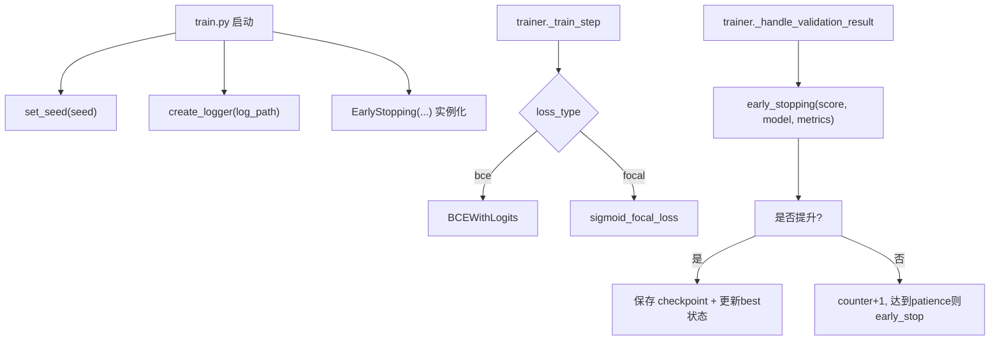
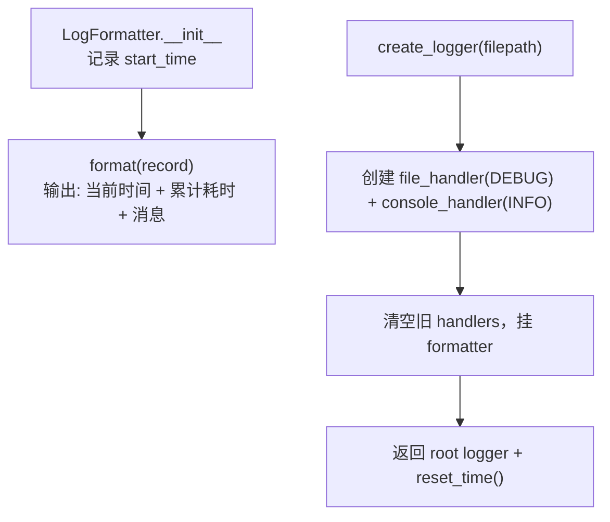
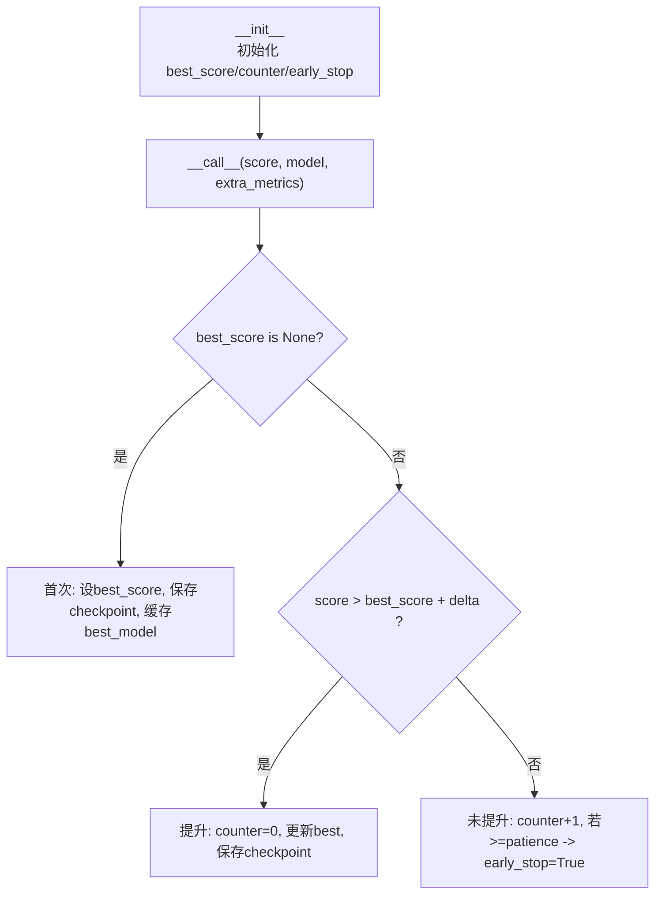
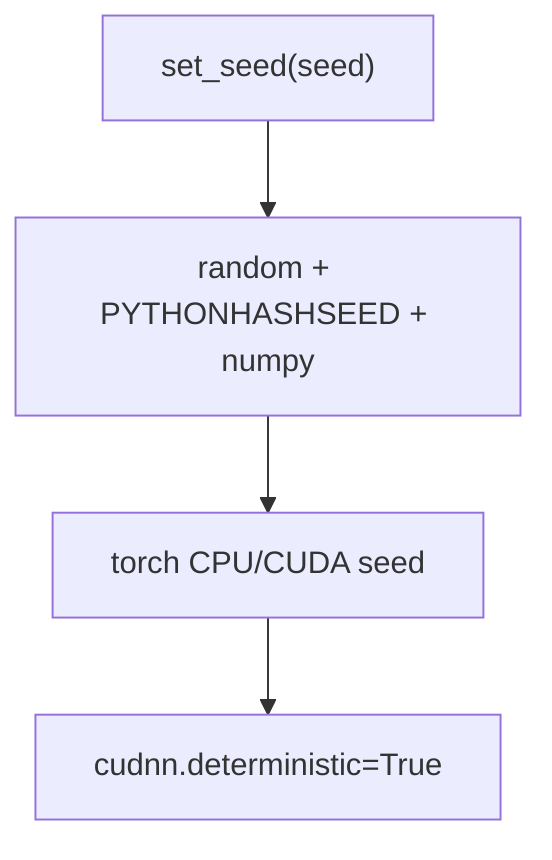
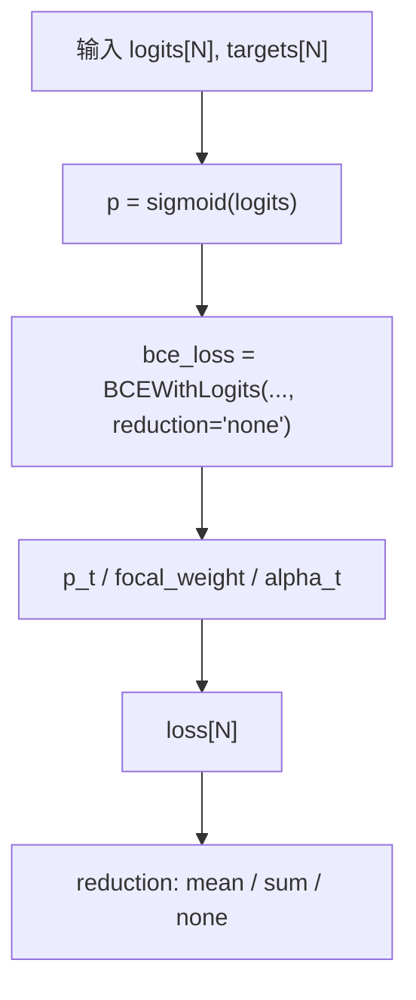

# `utils.py` 全流程文档（仿 `dataset_pipeline_from_demo1000.md` 风格）

目标：用通俗、可对照代码的方式讲清楚 `utils.py` 在训练系统里到底提供了什么能力，以及这些能力在 `train.py`/`trainer.py` 中怎么被使用。

---

## 1. 关键变量先看懂

- `logger`：全局根日志器（root logger）
- `LogFormatter.start_time`：日志“累计耗时”的起点
- `EarlyStopping.best_score`：当前最佳验证分数
- `EarlyStopping.counter`：连续未提升次数
- `EarlyStopping.early_stop`：是否触发早停
- `EarlyStopping.checkpoint_path`：当前 best 模型保存路径
- `logits`：模型原始输出（未 sigmoid）
- `targets`：0/1 标签
- `alpha/gamma`：Focal Loss 的类别权重与难例聚焦参数

---

## 2. 这个文件在全项目中的位置

`utils.py` 不是模型结构层，而是训练基础设施层，提供四件事：

1. 日志格式与 logger 创建
2. EarlyStopping（早停 + 保存最佳模型）
3. 全局随机种子设置
4. Focal Loss 计算

---

## 3. 总流程图（快速理解）

---

## 4. 详细流程图（分模块，彼此无因果连线）

> 说明：下面 4 张图是**并列工具模块**，不是前后依赖链。  
> 只画模块内部真实逻辑，不画不存在的跨模块因果关系。

### 4.1 模块A：日志系统（`LogFormatter` + `create_logger`）

### 4.2 模块B：早停系统（`EarlyStopping`）

### 4.3 模块C：随机种子（`set_seed`）

### 4.4 模块D：Focal Loss（`sigmoid_focal_loss`）

---

## 5. 每个函数在做什么（按代码）

## 5.1 `LogFormatter`

### 做什么

- 每条日志前加：
  - 当前时间（wall-clock）
  - 从 `start_time` 起算的累计耗时
- 多行日志会自动缩进，保证可读性

### 输入输出

- 输入：`logging.LogRecord`
- 输出：格式化后的字符串

---

## 5.2 `create_logger(filepath)`

### 做什么

1. 新建 `LogFormatter`
2. 创建文件日志（DEBUG）+ 控制台日志（INFO）
3. 清理 root logger 旧 handlers，避免重复日志
4. 挂载 `reset_time()` 方法

### 结果

- 返回可直接使用的 root logger
- 日志写入文件和控制台，格式统一

---

## 5.3 `EarlyStopping`

### 判定规则

- “提升”定义：`score > best_score + delta`

### 三个分支

1. **首次调用**
- 设 `best_score`
- 保存 checkpoint
- 缓存 `best_model`

2. **未提升**
- `counter += 1`
- 若 `counter >= patience` -> `early_stop=True`

3. **提升**
- 重置 `counter=0`
- 更新 best 状态
- 保存 checkpoint

### `save_checkpoint`

- 确保目录存在
- `torch.save(model.state_dict(), checkpoint_path)`
- 更新 `best_saved_score`

---

## 5.4 `set_seed(seed)`

统一设置：

- `random`
- `PYTHONHASHSEED`
- `numpy`
- `torch` CPU/CUDA
- `torch.backends.cudnn.deterministic = True`

作用：尽量提升可复现性（但不是“绝对位级复现”）。

---

## 5.5 `sigmoid_focal_loss`

### 输入 shape

- `logits: [N]`
- `targets: [N]`

### 中间量 shape

- `p: [N]`
- `bce_loss: [N]`
- `p_t: [N]`
- `focal_weight: [N]`
- `alpha_t: [N]`
- `loss: [N]`

### 输出

- `reduction='mean'` -> 标量
- `reduction='sum'` -> 标量
- `reduction='none'` -> `[N]`

---

## 6. 完整样例（按真实训练路径 + shape 代入）

假设：

- `batch_size = 256`
- `loss_type = focal`
- 当前 step 的：
  - `logits`（squeeze 后）`[256]`
  - `label.float()` `[256]`
- 当前验证 AUC 序列：`0.701 -> 0.705 -> 0.704 -> 0.704`
- `patience=2`

### 6.1 `sigmoid_focal_loss` 路径

1. 输入：
   - `logits [256]`
   - `targets [256]`
2. 输出：
   - `loss`（标量，默认 mean）
3. trainer 用这个标量做 `backward()`

### 6.2 EarlyStopping 状态变化

1. AUC=0.701（首次）
- 保存 checkpoint
- `best_score=0.701`, `counter=0`

2. AUC=0.705（提升）
- 再次保存
- `best_score=0.705`, `counter=0`

3. AUC=0.704（未提升）
- `counter=1`

4. AUC=0.704（未提升）
- `counter=2 >= patience`
- `early_stop=True`

### 6.3 logger 在训练中的表现

每条日志会显示：

- 当前时间
- 从训练开始累计耗时
- 消息正文（多行自动对齐）

---

## 7. 与其他文件的调用关系

1. **`train.py`**
- 调 `set_seed`
- 调 `create_logger`
- 实例化 `EarlyStopping`

2. **`trainer.py`**
- 调 `sigmoid_focal_loss`（当 `loss_type=focal`）
- 调 `early_stopping(...)` 更新早停状态
- 读取 `early_stopping.early_stop` 决定是否停止训练

---

## 8. 易错点（实战高频）

1. `EarlyStopping` 默认“越大越好”，不适合直接监控“越小越好”的指标。  
2. `checkpoint_path` 若目录不可写，会导致保存失败。  
3. `sigmoid_focal_loss` 输入 `logits/targets` shape 必须对齐。  
4. `targets` 语义应是 0/1，非二值会破坏损失语义。  
5. 只设 `deterministic=True` 仍可能存在非完全位级复现。  

---

## 9. 详细总结

`utils.py` 是训练系统的基础支撑层：

1. 用统一日志格式让训练过程可追踪  
2. 用 EarlyStopping 让训练“有停机条件且能保存最佳模型”  
3. 用全局种子控制让实验更可复现  
4. 提供 Focal Loss 支持不平衡样本训练  
5. 与 `train.py`/`trainer.py` 深度耦合但与模型结构解耦  

## 10. 一句话总结

`utils.py` 提供了训练系统最关键的“稳态能力”：可追踪、可早停、可复现、可切换损失。

